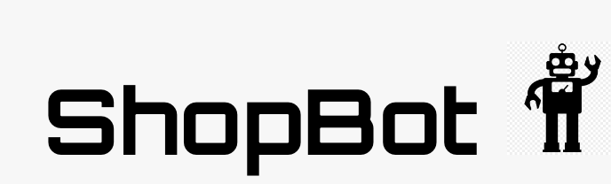

## Overview

ShopBot is a smart customer support chatbot for e-commerce stores, helping customers get quick answers and track their orders 24/7.

### Problem

Online shoppers often struggle to find product information or resolve issues quickly. Traditional storefront support can be slow, leading to frustration. ShopBot can provide instant assistance to improve the shopping experience.

### User Profile

- **Online Shoppers**:

  - Need quick answers about products and orders.
  - Prefer immediate help, even outside business hours.

- **Store Owners**:
  - Want to enhance customer satisfaction.
  - Looking to reduce the workload on support teams.

### Features

- Ask product questions and get instant responses.
- Track order status.
- Get help with returns and refunds.
- Find answers to common questions.
- Store owners can manage chatbot responses and view analytics.
- Seamless integration with Shopify stores.

## Implementation

### Tech Stack

- **Front-End**: React, JavaScript, SCSS,
- **Back-End**: Express, MySql, Knex

### APIs

- Integrates with Shopify API for product and order info. (for testing will be using an API that has test storefront order/product information available)

### Sitemap

1. Home Page
2. Register
3. Login
4. Chat Interface
5. Profile Page

### Mockups

### Data

### Endpoints

**GET /products**

- Fetch product details from the store.

Parameters:

- token (optional): JWT for authenticated requests

Response:
[
{
"id": 1,
"name": "Example Product",
"price": 29.99,
"description": "A great product"
},
]

**GET /orders/:id**: Fetch order details.

Parameters:

- id: Order ID
- token (optional): JWT for authenticated requests

Response:
{
"id": 1,
"status": "Shipped",
"trackingNumber": "123456789",
"items": [
{
"productId": 1,
"name": "Product 1",
"quantity": 2
},
]
}

**POST /users/register**: Register a user.

- Add a user account.

Parameters:

- email: User's email
- password: User's provided password

{
"token": "eyJhbGciOiJIUzI1NiIsInR5cCI6IkpXVCJ9.eyJzdWIiOiIxMjM0NTY3ODkwIiwibmFtZSI6I..."
}

Response: 

**POST /users/login**: Login a user.

Parameters:

- email: User's email
- password: User's provided password

Response:

{
"token": "eyJhbGciOiJIUzI1NiIsInR5cCI6IkpXVCJ9.eyJzdWIiOiIxMjM0NTY3ODkwIiwibmFtZSI6I..."
}

### Auth

- Uses JWT for secure authentication.

## Roadmap

1. Set up React and Rails projects with all necessary components and routes.
2. Build chat interface and widget.
   - Implement chat interface page
   - Store chat history in sessionStorage
   - Create GET /products endpoint
   - look into integrating AI responses
   -
3. Create sample data and deploy projects.
4. Implement user registration and login.
   - Implement register and login pages
   - Create POST /users/register endpoint
   - Create POST /users/login endpoint
5. Add JWT authentication.
   - Server: Update expected requests/responses on protected endpoints
   - Client: Store JWT in localStorage, include JWT on axios calls
6. Fix bugs and prepare for demo.

## Nice-to-haves

- Add more advanced analytics and multi-language support.
- Include AI-powered response suggestions.
- Have the ability to use user profiles with order history and saved products.
- Integrate with more e-commerce platforms.
